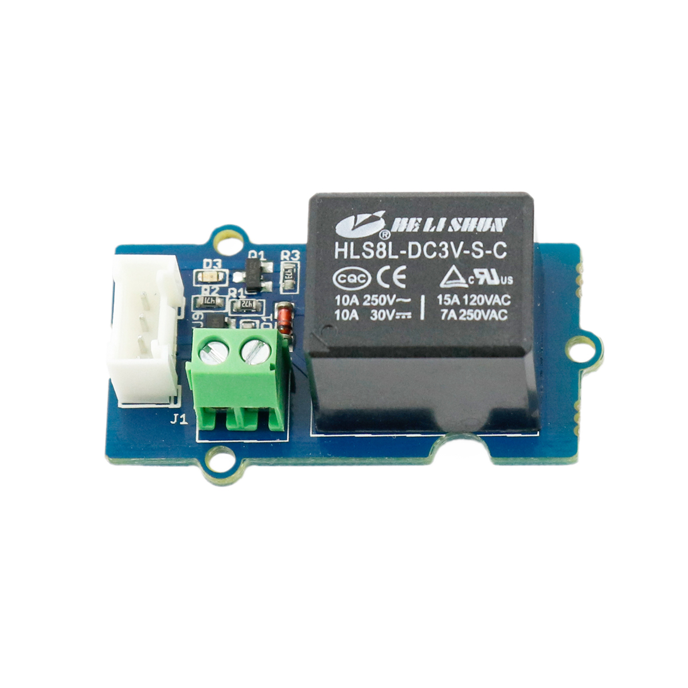

---
title: "Relaiskarte"
date: "2018-10-01T14:28:00.000Z"
tags: 
  - "output"
coverImage: "48_relaiskarte.jpg"
material_number: "48"
material_type: "output"
material_short_descr: "Seeed Studio Grove – Relay"
manufacture: "Seeed Studio"
manufacture_url: "https://www.seeedstudio.com/"
repo_name: "mks-SeeedStudio-Grove_Relay"
repo_prefix: "mks"
repo_manufacture: "SeeedStudio"
repo_part: "Grove_Relay"
product_url: "https://wiki.seeedstudio.com/Grove-Relay/"
clone_url: "https://github.com/Make-Your-School/mks-SeeedStudio-Grove_Relay.git"
embedded_example_file: "examples/Grove_Relay_minimal/Grove_Relay_minimal.ino"
---

# Relaiskarte

## Beschreibung
Eine Relaiskarte ist eine Platine, die es einem Mikrocontroller ermöglicht, ein Relais anzusteuern, was im Allgemeinen nicht ohne weitere Komponenten möglich ist.  Ein Relais wird zum Schalten von elektronischen Komponenten eingesetzt. Es funktioniert dabei ähnlich wie ein Handschalter, nur, dass ein Elektromagnet die benötigte Stellkraft des Schaltens zur Verfügung stellt. Da ein direkt an einen Mikrocontroller angeschlossener Elektromagnet den Controller zerstören kann, besitzt die Relaiskarte alle notwendigen Schutz- und Wandlungskomponenten. So können auch Geräte mit hoher Leistung oder höheren Spannungen mit einem Mikrocontroller geschaltet werden. Die Relaiskarte lässt sich direkt oder mithilfe des Grove Shields an einen Arduino oder Raspberry Pi anschließen. Mit einem einfachen \[simple\_tooltip content='Digital vs analog: • Analoge Signale können beliebige, kontinuierliche Werte annehmen. Sie verändern sich stufenlos. Dadurch können theoretisch unendlich kleine Änderungen (und damit ein unendlicher Informationsinhalt) übertragen werden. Einschränkend wirkt die Genauigkeit, mit der das analoge Signal ausgelesen/erfasst wird. • Das digitale Signal nimmt nur diskrete Werte an und springt bei einer etwaigen Änderung von einem Wert zum nächsten. Es kann nur eine definierte Anzahl an Informationsinhalten übertragen werden. Vorteilhaft ist dagegen die damit verbundene Fehlerfreiheit bei minimalsten, ungewollten Schwankungen. Oftmals werden nur zwei Werte HIGH und LOW (Ein/Aus oder 1/0) übermittelt.'\] digitalen HIGH-Signal\[/simple\_tooltip\] wird das Relais geschaltet und damit ein Schaltkreis geschlossen.

Die Relaiskarte kann zum Beispiel zum automatischen Anschalten einer Kaffeemaschine eingesetzt werden.

Alle weiteren Hintergrundinformationen, sowie ein Beispielaufbau und alle notwendigen Programmbibliotheken sind auf dem offiziellen Wiki (bisher nur in englischer Sprache) von Seeed Studio zusammengefasst. Zusätzlich findet man über alle gängigen Suchmaschinen meist nur mit der Eingabe der genauen Komponentenbezeichnungen entsprechende Projektbeispiele und Tutorials.

<!-- infolist -->

<!-- infolists -->
## Wichtige Links für die ersten Schritte:

- [Seeed Studio Wiki](http://wiki.seeedstudio.com/Grove-Relay/) [- Relaiskarte](http://wiki.seeedstudio.com/Grove-Relay/)

## Weiterführende Hintergrundinformationen:

- [GPIO - Wikipedia Artikel](https://de.wikipedia.org/wiki/Allzweckeingabe/-ausgabe)
- [GitHub-Repository: Relaiskarte](https://github.com/MakeYourSchool/48-Relaiskarte)

